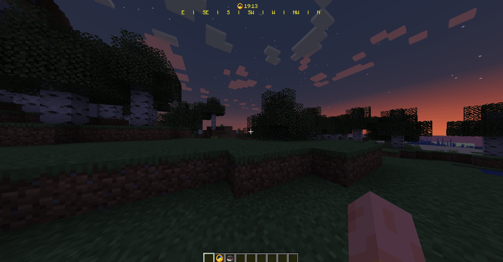

# Minecraft Power HUD

A simple mod that powers up the player's HUD (Clock, Compass, Coordinates, etc.)

### Some of the features are:
- Real time clock in HUD
- Roll compass in HUD

## Requirements
- Java 17+
- Fabric Launcher
- Fabric API

## Installation

1. Download and install fabric launcher from the [official website](https://fabricmc.net/).

2. Download the mod from the [releases page](https://github.com/vmarinho22/minecraft-power-hud/releases).

3. Put the downloaded file in the mods folder of your minecraft installation (`.minecraft/mods`).

4. Start the game fabric api and enjoy!

## In game example

